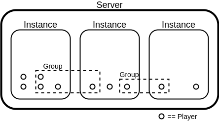
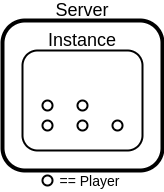

# GNA

GNA stands for Game Networking Abstraction, it packs a server and a client for games written in Go. It's built around ```encoding/gob``` and persistent TCP connections (i'm planning to support UDP Broadcasting as well, but the TCP will still be the foundation to comunicate UDP addresses). Although very simple, it is very powerfull, you can: 
- embed it into a client or use as standalone server
- use a single instance or multiple instances concurrently
- unicast, multicast and broadcast messages within and between instances
- do it easily

Note: Right now i do not recommend using this for servers over ~32 players, see issue #1.

## Installation

```go get github.com/kazhmir/gna```

## Usage

### Components
<p align="center">
  
</p>

This image helps visualize how the components play together, from bottom up:

- **Player**: this data strucure owns the connection to the client, it contains an unique uint64 ID and is reponsible for receiving and dispatching data from/to the client.

- **Group**: a collection of Players protected by a sync.Mutex, it can be used to multicast the same piece of data to every Player inside it, regardless of Instance. Every instance has a Group named Net.Players that contain all players in the instance. The Group is not aware of the state of each connection, meaning you need to keep track of Players in your implementation.

- **Instance**: it's built from two pieces: Logic and Net. Players can only send data to one Instance at a time, but a Instance can Dispatch data to any Player.
	- **Logic**: it's your server logic, represented by the methods Auth, Disconn and Update. The method Auth is run only in the main Instance, the Disconn is run whenever a Player disconnects and the Update is run once every tick.

	- **Net**: it's the networking abstraction inside the Instance. It has a bucket or acumulator where all Players inside the instance deposits data, this bucket is flushed and retrieved every time you call Net.GetData(). You can use Net.Dispatch to send data to Players or Groups.

- **Server**: the server is your whole application. It can contain one or more Listeners, each listener with one main Instance, in which the Auth method will be called. This listeners can set players to any instance, but if not set, the main Instance is used as default.

Although the above image uses every component as an example, most simple servers will only be:

<p align="center">
  
</p>

### How it goes

You will need to create a struct to represent your instance, like the following:

```go
type Instance struct {
	/*Embedding is necessary to import the GetData, Terminate, NetAbs, and Dispatch methods
	as well as all the functionality*/
	gna.Net
}

/*Here you will validate the Player,
 you can use Player.Send() and Player.Recv() to
authenticate the Player. If not valid,
 you can just close the connection: Player.Close()*/
func (e *Instance) Auth(p *gna.Player) {}

/*This is the Disconn handler, the connection 
is already closed at this stage, you can access 
the cause of disconnection with Player.Error()
 and keep track of the players with Player.ID*/
func (e *Instance) Disconn(p *gna.Player) {}

/*Update is called every tick, here you can
 update your game state. Use Instance.GetData to get
the data from the Players and Instance.Dispatch to send data.*/
func (e *Instance) Update() {}
```

and then run it with: 
```go
err := gna.RunServer(":8888", &Instance{})
```

To better understand how it all works, go through the examples.

## Examples
All examples also contain their respective clients.

- [echo](./examples/echo): Echoes all incoming data to all players, very simple but not very useful
- [oneChatRoom](./examples/oneChatRoom): The simplest useful app possible, a single CLI chat room
- [manyChatRooms](./examples/manyChatRooms): A build up on the above, with many rooms which clients can choose and a few server commands
- [blobs](./examples/blobs): A simple 2D grid with blobs, the very basics of a 2D game server, with Ebiten Client.
